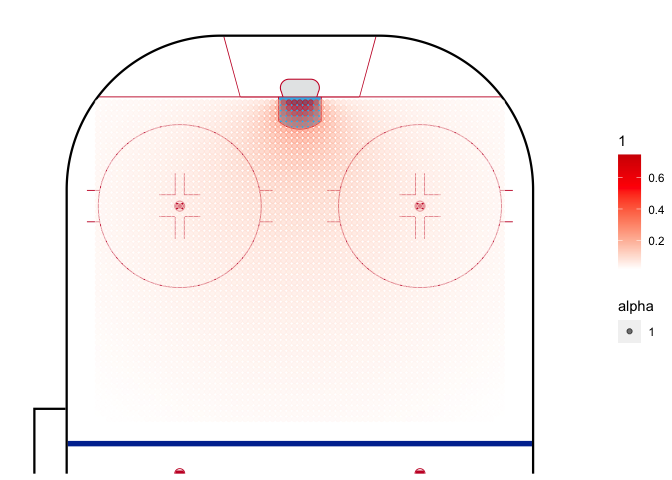

## Overview and Scope

The aim of this project is to build different naive Expected Goals models using LPM, logit and possibly other regression models. The data is obtained from [Kaggle](https://www.kaggle.com/datasets/martinellis/nhl-game-data). 

Valuable sources have been: 

* https://github.com/Dato-Futbol/xg-model/blob/master/04code_evaluate_use_models.R
* https://www.thesignificantgame.com/portfolio/expected-goals-model-with-tidymodels/
* https://www.datofutbol.cl/xg-model/
* https://medium.com/datos-y-ciencia/una-mirada-al-soccer-analytics-usando-r-parte-iii-3bdff9cd3752
* https://rstudio-pubs-static.s3.amazonaws.com/311470_f6e88d4842da46e9941cc6547405a051.html
* https://soccermatics.readthedocs.io/en/latest/gallery/lesson2/plot_xGModelFit.html
* https://github.com/iandragulet/xG_Model_Workflow/blob/main/xG_model_part1.ipynb


## Data Wrangling

Loading the data and creating a variable for shot data 

```r
game_plays <- read.csv("~/Downloads/archive/game_plays.csv")

## Making sure the data looks correct, showing first 15 samples and the response variable
str(game_plays[,c(1:15, 18)])
```

```
## 'data.frame':	5050529 obs. of  16 variables:
##  $ play_id            : chr  "2016020045_1" "2016020045_2" "2016020045_3" "2016020045_4" ...
##  $ game_id            : int  2016020045 2016020045 2016020045 2016020045 2016020045 2016020045 2016020045 2016020045 2016020045 2016020045 ...
##  $ team_id_for        : int  NA NA NA 16 16 16 4 4 16 16 ...
##  $ team_id_against    : int  NA NA NA 4 4 4 16 16 4 4 ...
##  $ event              : chr  "Game Scheduled" "Period Ready" "Period Start" "Faceoff" ...
##  $ secondaryType      : chr  NA NA NA NA ...
##  $ x                  : int  NA NA NA 0 -71 -88 0 56 11 -68 ...
##  $ y                  : int  NA NA NA 0 9 5 0 -7 21 37 ...
##  $ period             : int  1 1 1 1 1 1 1 1 1 1 ...
##  $ periodType         : chr  "REGULAR" "REGULAR" "REGULAR" "REGULAR" ...
##  $ periodTime         : int  0 0 0 0 54 56 58 69 78 88 ...
##  $ periodTimeRemaining: int  1200 1200 1200 1200 1146 1144 1142 1131 1122 1112 ...
##  $ dateTime           : chr  "2016-10-18 23:40:58" "2016-10-19 01:35:28" "2016-10-19 01:40:50" "2016-10-19 01:40:50" ...
##  $ goals_away         : int  0 0 0 0 0 0 0 0 0 0 ...
##  $ goals_home         : int  0 0 0 0 0 1 1 1 1 1 ...
##  $ st_y               : int  NA NA NA 0 -9 -5 0 -7 -21 -37 ...
```

Parsing the data to include only the shots and goals

```r
shots <- game_plays %>%
  filter(event %in% c("Goal", "Shot")) %>%
  select(team_id_for, event, st_x, st_y, secondaryType)

## Creating a new column for a binary response variable if a shot was a goal or not
shots$goal <- as.integer(ifelse(shots$event == "Goal", 1,0))
```

Creating local variables for x and y cordinates

```r
##Taking the absolute value to have all the shots in the same horizontal axis
x <- abs(shots$st_x)
y <- shots$st_y
```

Creating functions for distance and angle. Distance is calculated by 

$c^2 = a^2 + b^2 \Rightarrow c = \sqrt{a^2 + b^2 }$

The angle to the goal is calculated as follows, 

$\tan \theta = \frac{\text{goal width } * x }{x^2 + y^2 - (\frac{\text{goal width}}{2})^2 }$


```r
distance <- function(x_pos, y_pos) {
  sqrt((89 - abs(x_pos))^2 + y_pos^2)
}

angle_theta <- function(x_pos, y_pos) {
  x_temp <- abs(89 - abs(x_pos))
    ifelse((x_temp)^2 + (y_pos)^2 >= 9, atan((6 * abs(x_temp))/(x_temp^2 + y_pos^2 - 3^2)) * 180 / pi,
    180 + atan((6 * x_temp)/(x_temp^2 + y_pos^2 - 3^2)) * 180 / pi)
}

## Making sure our range is correct, should be between 0 and 180
range(angle_theta(x,y),na.rm=TRUE)
```

```
## [1]   0 180
```

```r
## Adding columns for distance and angle
shots <- shots %>%
  mutate(distance = distance(shots$st_x, shots$st_y),
                    angle = angle_theta(shots$st_x, shots$st_y))
## Testing this works
head(shots)
```

```
##   team_id_for event st_x st_y secondaryType goal distance     angle
## 1          16  Shot   71   -9    Wrist Shot    0 20.12461 15.255119
## 2          16  Goal   88   -5   Wrap-around    1  5.09902 19.440035
## 3           4  Shot   56   -7    Wrist Shot    0 33.73426  9.947172
## 4          16  Shot   37   24     Slap Shot    0 57.27128  5.448598
## 5           4  Shot   57  -20    Wrist Shot    0 37.73592  7.727217
## 6           4  Shot   34   14     Slap Shot    0 56.75385  5.865971
```
## Plots

### Histograms

A couple of histograms from the data that show the distribution of shot distance and angle

```r
par(mar = c(4, 4, .1, .1))
ggplot(shots, aes(x=shots$angle)) +
  geom_histogram(binwidth = 3,
                 center = 0,
                 color = "black",
                 fill = "white") +
  scale_x_continuous(limits = c(0, 180)) +
  theme_bw() +
  theme(panel.border = element_blank()) + 
  theme(panel.grid.major = element_blank()) +
  theme(panel.grid.minor = element_blank()) + 
  xlab("Angles") + 
  ylab(element_blank()) + 
  ggtitle("Histogram of Shot Angles")

ggplot(shots, aes(x=distance)) +
    geom_histogram(binwidth = 6,
                   center = 0,
                   color = "black",
                   fill = "white") +
    scale_x_continuous(limits = c(0, 180)) +
    theme_bw() +
  theme(panel.border = element_blank()) + 
    theme(panel.grid.major = element_blank()) +
    theme(panel.grid.minor = element_blank()) + 
    xlab("Distance") + 
    ylab(element_blank()) + 
    ggtitle("Histogram of Shot Distances")
```


### Probability of a Goal Given Distance or Angle

```r
bins_distance <- aggregate(shots,
                   by=list(cut(shots$distance, seq(0,100,10))),
                   mean)

bins_angle <- aggregate(shots,
                  by=list(cut(shots$angle, seq(0,180,10))),
                  mean)

## Changing the first column to numeric values so that ggplot geom_smooth works
bins_distance$Group.1 <- as.numeric(bins_distance$Group.1)
bins_angle$Group.1 <- as.numeric(bins_angle$Group.1)

angles <- as.character(seq(0, 180, 10))
distances <- as.character(seq(0, 90, 10))


ggplot(bins_distance, aes(x= bins_distance$Group.1, y =  bins_distance$goal)) +
                          geom_point() +
                          geom_line() +
                          theme_bw() + 
                          xlab("Distance to goal (Feet)") +
                          ylab("Probability of Goal") + 
                          scale_x_discrete(limits = distances) +
                          ggtitle("Probability of Goal Given the Distance")
                          
ggplot () + aes(x= bins_angle$Group.1, y =  bins_angle$goal) +
  geom_point() +
  geom_smooth(method=lm, se = F) + 
  theme_bw() +
  xlab("Angle to Goal") +
  ylab("Probability of Goal") + 
  ggtitle("Probability of Goal Given the Angle") +
  scale_x_discrete(limits = angles)
```


In the distance to goal there's an interesting fact: probability of goal increases with distance. This is likely due to the fact that usually shots from very far away are shot due to empty goal: hence it scewing the data. In angle to goal there's no notable surprises. 


This chunk is saved for possible future uses. To ensure unbiasedness, training data has to be separated from the actual testing data. With the following commands the sample is randomized and 70% of it would be used for the training data. 

```r
#train_test_split <- initial_split(data = shots, prop = 0.7)

#train_data <- train_test_split %>%
#  training()
#test_data <- train_test_split %>%
#  testing()
```


```r
LPM <- lm(goal ~ distance + angle, data = shots)
summary(LPM)
```

```
## 
## Call:
## lm(formula = goal ~ distance + angle, data = shots)
## 
## Residuals:
##      Min       1Q   Median       3Q      Max 
## -0.91707 -0.10938 -0.06293 -0.03941  1.01860 
## 
## Coefficients:
##               Estimate Std. Error t value Pr(>|t|)    
## (Intercept)  7.185e-02  1.214e-03   59.21   <2e-16 ***
## distance    -1.076e-03  2.244e-05  -47.96   <2e-16 ***
## angle        4.708e-03  4.078e-05  115.44   <2e-16 ***
## ---
## Signif. codes:  0 '***' 0.001 '**' 0.01 '*' 0.05 '.' 0.1 ' ' 1
## 
## Residual standard error: 0.2843 on 929479 degrees of freedom
##   (64674 observations deleted due to missingness)
## Multiple R-squared:  0.05005,	Adjusted R-squared:  0.05004 
## F-statistic: 2.448e+04 on 2 and 929479 DF,  p-value: < 2.2e-16
```

```r
LPM_distance <- as.numeric(LPM$coefficients["distance"])
LPM_angle <- as.numeric(LPM$coefficients["angle"])
LPM_intercept <- as.numeric(LPM$coefficients["(Intercept)"])
LPM_manual <- LPM_intercept + LPM_distance * shots$distance + LPM_angle * shots$angle
```
In the plot below, the the main downside of LPM model becomes apparent: results are not bound [0,1]. 

```r
ggplot(data = LPM, mapping=aes(x=angle, y = goal)) +
  geom_point() + geom_smooth(method = "lm", se = F) +
  theme_bw()
```

<!-- -->

Because of this and various other reasons, logit is used. 


```r
logit <- glm(goal ~ distance + angle,
             family = binomial(link = 'logit'),
             data = shots)

summary(logit)
```

```
## 
## Call:
## glm(formula = goal ~ distance + angle, family = binomial(link = "logit"), 
##     data = shots)
## 
## Deviance Residuals: 
##     Min       1Q   Median       3Q      Max  
## -2.2891  -0.4820  -0.3568  -0.2794   3.0004  
## 
## Coefficients:
##               Estimate Std. Error z value Pr(>|z|)    
## (Intercept) -1.8507032  0.0147610 -125.38   <2e-16 ***
## distance    -0.0277390  0.0003334  -83.21   <2e-16 ***
## angle        0.0247258  0.0004099   60.32   <2e-16 ***
## ---
## Signif. codes:  0 '***' 0.001 '**' 0.01 '*' 0.05 '.' 0.1 ' ' 1
## 
## (Dispersion parameter for binomial family taken to be 1)
## 
##     Null deviance: 578868  on 929481  degrees of freedom
## Residual deviance: 537069  on 929479  degrees of freedom
##   (64674 observations deleted due to missingness)
## AIC: 537075
## 
## Number of Fisher Scoring iterations: 6
```

```r
logit_distance <- as.numeric(logit$coefficients["distance"])
logit_angle <- as.numeric(logit$coefficients["angle"])
logit_intercept <- as.numeric(logit$coefficients["(Intercept)"])
logit_value <- 1/(1+exp(logit_intercept + logit_distance * shots$distance + logit_angle * shots$angle))
```
In a logit model, the probability of an event is given by 

$P = \frac{1}{1 + - exp^{-{(\beta_0 + \beta_1 x_1 \beta_2 x_2 + …)}}}$


```r
ggplot(logit, aes(x=distance, y =goal)) +
  geom_point() + geom_smooth(method = "glm", method.args = list(family = "quasibinomial"), se = F) +
  scale_x_reverse() +
  theme_bw() +
  xlab("Distance to Goal") +
  ylab("Probability of Goal") + 
  ggtitle("Distance as an explanatory variable") 

ggplot(logit, aes(x=angle, y =goal)) +
  geom_point() + geom_smooth(method = "glm", method.args = list(family = "quasibinomial"), se = F) +
  theme_bw() +
  xlab("Angle to Goal") +
  ylab("Probability of Goal") + 
  ggtitle("Angle as an explanatory variable") 
```


From graphs above, it becomes visually clear that angle is a way more important factor affecting if a shot is a goal or not. 


```r
artificial_shots <- crossing(location_x = seq(30, 88, by = 1), location_y = seq(-37, 37, by = 1))

artificial_shots$distance <- distance(artificial_shots$location_x, artificial_shots$location_y)
artificial_shots$angle <- angle_theta(artificial_shots$location_x, artificial_shots$location_y)
artificial_shots$xg <- LPM_intercept + distance(artificial_shots$location_x,artificial_shots$location_y) * LPM_distance + angle_theta(artificial_shots$location_x, artificial_shots$location_y) * LPM_angle

geom_hockey(league = "NHL", rotation = 90, display_range = "ozone") +
  geom_point(aes(x = artificial_shots$location_y, y = artificial_shots$location_x, col = artificial_shots$xg, alpha = 1)) +
  scale_color_gradient2(low = "white", mid="red", midpoint = 0.55, high ="darkred",
                       scales::rescale(c(0.9,0.1)))
```

<!-- -->


```r
artificial_shots <- crossing(location_x = seq(30, 88, by = 1), location_y = seq(-37, 37, by = 1))

artificial_shots$distance <- distance(artificial_shots$location_x, artificial_shots$location_y)
artificial_shots$angle <- angle_theta(artificial_shots$location_x, artificial_shots$location_y)
artificial_shots$xg_logit <- 1 / (1 + exp(-logit_intercept - distance(artificial_shots$location_x,artificial_shots$location_y) * logit_distance - angle_theta(artificial_shots$location_x, artificial_shots$location_y) * logit_angle))


geom_hockey(league = "NHL", rotation = 90, display_range = "ozone") +
  geom_point(aes(x = artificial_shots$location_y, y = artificial_shots$location_x, col = artificial_shots$xg_logit, alpha = 0.1)) +
  scale_color_gradient(low = "white", high ="red",
                       scales::rescale(c(0.1,0.9))) 
```

<!-- -->


