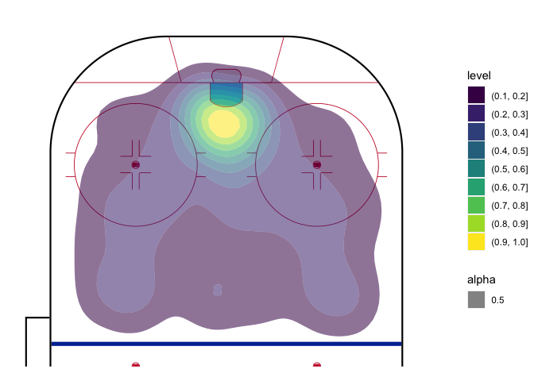

NHL xG
================

- <a href="#overview-and-scope" id="toc-overview-and-scope">Overview and
  Scope</a>
- <a href="#data-wrangling" id="toc-data-wrangling">Data Wrangling</a>
- <a href="#data-exploration" id="toc-data-exploration">Data
  Exploration</a>
  - <a href="#histograms" id="toc-histograms">Histograms</a>
  - <a href="#probability-of-a-goal-given-distance-or-angle"
    id="toc-probability-of-a-goal-given-distance-or-angle">Probability of a
    Goal Given Distance or angle</a>
  - <a href="#shot-plots" id="toc-shot-plots">Shot Plots</a>
- <a href="#basic-regression-models"
  id="toc-basic-regression-models">Basic Regression Models</a>
  - <a href="#linear-probability-model"
    id="toc-linear-probability-model">Linear Probability Model</a>
  - <a href="#logit-part-1" id="toc-logit-part-1">Logit Part 1</a>
- <a href="#other-regression-and-classification-models"
  id="toc-other-regression-and-classification-models">Other Regression and
  Classification Models</a>
  - <a href="#introduction-and-adding-variables"
    id="toc-introduction-and-adding-variables">Introduction and adding
    variables</a>
  - <a href="#logit-part-2" id="toc-logit-part-2">Logit Part 2</a>
  - <a href="#random-forest" id="toc-random-forest">Random Forest</a>

## Overview and Scope

The aim of this project is to build different naive Expected Goals
models using LPM, logit and possibly other regression models. The data
is obtained from
[Kaggle](https://www.kaggle.com/datasets/martinellis/nhl-game-data).

Valuable sources have been:

- <https://github.com/Dato-Futbol/xg-model/blob/master/04code_evaluate_use_models.R>
- <https://www.thesignificantgame.com/portfolio/expected-goals-model-with-tidymodels/>
- <https://www.datofutbol.cl/xg-model/>
- <https://medium.com/datos-y-ciencia/una-mirada-al-soccer-analytics-usando-r-parte-iii-3bdff9cd3752>
- <https://rstudio-pubs-static.s3.amazonaws.com/311470_f6e88d4842da46e9941cc6547405a051.html>
- <https://soccermatics.readthedocs.io/en/latest/gallery/lesson2/plot_xGModelFit.html>
- <https://github.com/iandragulet/xG_Model_Workflow/blob/main/xG_model_part1.ipynb>

## Data Wrangling

Loading the data and creating a variable for shot data

``` r
game_plays <- read.csv("~/Downloads/archive/game_plays.csv")

## Making sure the data looks correct, showing first 18 samples and the response variable
str(game_plays)
```

    ## 'data.frame':    5050529 obs. of  18 variables:
    ##  $ play_id            : chr  "2016020045_1" "2016020045_2" "2016020045_3" "2016020045_4" ...
    ##  $ game_id            : int  2016020045 2016020045 2016020045 2016020045 2016020045 2016020045 2016020045 2016020045 2016020045 2016020045 ...
    ##  $ team_id_for        : int  NA NA NA 16 16 16 4 4 16 16 ...
    ##  $ team_id_against    : int  NA NA NA 4 4 4 16 16 4 4 ...
    ##  $ event              : chr  "Game Scheduled" "Period Ready" "Period Start" "Faceoff" ...
    ##  $ secondaryType      : chr  NA NA NA NA ...
    ##  $ x                  : int  NA NA NA 0 -71 -88 0 56 11 -68 ...
    ##  $ y                  : int  NA NA NA 0 9 5 0 -7 21 37 ...
    ##  $ period             : int  1 1 1 1 1 1 1 1 1 1 ...
    ##  $ periodType         : chr  "REGULAR" "REGULAR" "REGULAR" "REGULAR" ...
    ##  $ periodTime         : int  0 0 0 0 54 56 58 69 78 88 ...
    ##  $ periodTimeRemaining: int  1200 1200 1200 1200 1146 1144 1142 1131 1122 1112 ...
    ##  $ dateTime           : chr  "2016-10-18 23:40:58" "2016-10-19 01:35:28" "2016-10-19 01:40:50" "2016-10-19 01:40:50" ...
    ##  $ goals_away         : int  0 0 0 0 0 0 0 0 0 0 ...
    ##  $ goals_home         : int  0 0 0 0 0 1 1 1 1 1 ...
    ##  $ description        : chr  "Game Scheduled" "Period Ready" "Period Start" "Jonathan Toews faceoff won against Claude Giroux" ...
    ##  $ st_x               : int  NA NA NA 0 71 88 0 56 -11 68 ...
    ##  $ st_y               : int  NA NA NA 0 -9 -5 0 -7 -21 -37 ...

Parsing the data to include only the shots and goals

``` r
shots <- na.omit(game_plays) %>%
  filter(event %in% c("Goal", "Shot")) %>%
  select(team_id_for, event, st_x, st_y, secondaryType)

## Creating a new column for a binary response variable if a shot was a goal or not
shots$goal <- as.integer(ifelse(shots$event == "Goal", 1,0))
```

Creating local variables for x and y cordinates

``` r
##Taking the absolute value to have all the shots in the same horizontal axis
x <- abs(shots$st_x)
y <- shots$st_y
```

Creating functions for distance and angle. Distance is calculated by

$c^2 = a^2 + b^2 \Rightarrow c = \sqrt{a^2 + b^2 }$

The angle to the goal is calculated as follows,

$\tan \theta = \frac{\text{goal width } * x }{x^2 + y^2 - (\frac{\text{goal width}}{2})^2 }$

``` r
distance <- function(x_pos, y_pos) {
  sqrt((89 - abs(x_pos))^2 + y_pos^2)
}

angle_theta <- function(x_pos, y_pos) {
  x_temp <- abs(89 - abs(x_pos))
    ifelse((x_temp)^2 + (y_pos)^2 >= 9, atan((6 * abs(x_temp))/(x_temp^2 + y_pos^2 - 3^2)) * 180 / pi,
    180 + atan((6 * x_temp)/(x_temp^2 + y_pos^2 - 3^2)) * 180 / pi)
}

## Making sure our range is correct, should be between 0 and 180
range(angle_theta(x,y),na.rm=TRUE)
```

    ## [1]   0 180

``` r
## adding columns for distance and angle
shots <- shots %>%
  mutate(distance = distance(shots$st_x, shots$st_y),
                    angle = angle_theta(shots$st_x, shots$st_y))
## Testing this works
head(shots)
```

    ##   team_id_for event st_x st_y secondaryType goal distance     angle
    ## 1          16  Shot   71   -9    Wrist Shot    0 20.12461 15.255119
    ## 2          16  Goal   88   -5   Wrap-around    1  5.09902 19.440035
    ## 3           4  Shot   56   -7    Wrist Shot    0 33.73426  9.947172
    ## 4          16  Shot   37   24     Slap Shot    0 57.27128  5.448598
    ## 5           4  Shot   57  -20    Wrist Shot    0 37.73592  7.727217
    ## 6           4  Shot   34   14     Slap Shot    0 56.75385  5.865971

## Data Exploration

### Histograms

a couple of histograms from the data that show the distribution of shot
distance and angle

``` r
par(mar = c(4, 4, .1, .1))
ggplot(shots, aes(x=shots$angle)) +
  geom_histogram(binwidth = 3,
                 center = 0,
                 color = "black",
                 fill = "white") +
  scale_x_continuous(limits = c(0, 180)) +
  theme_bw() +
  theme(panel.border = element_blank()) + 
  theme(panel.grid.major = element_blank()) +
  theme(panel.grid.minor = element_blank()) + 
  xlab("angles") + 
  ylab(element_blank()) + 
  ggtitle("Histogram of Shot angles")

ggplot(shots, aes(x=distance)) +
    geom_histogram(binwidth = 6,
                   center = 0,
                   color = "black",
                   fill = "white") +
    scale_x_continuous(limits = c(0, 180)) +
    theme_bw() +
  theme(panel.border = element_blank()) + 
    theme(panel.grid.major = element_blank()) +
    theme(panel.grid.minor = element_blank()) + 
    xlab("Distance") + 
    ylab(element_blank()) + 
    ggtitle("Histogram of Shot Distances")
```


### Probability of a Goal Given Distance or angle

``` r
bins_distance <- aggregate(shots,
                   by=list(cut(shots$distance, seq(0,100,10))),
                   mean)

bins_angle <- aggregate(shots,
                  by=list(cut(shots$angle, seq(0,180,10))),
                  mean)

## Changing the first column to numeric values so that ggplot geom_smooth works
bins_distance$Group.1 <- as.numeric(bins_distance$Group.1)
bins_angle$Group.1 <- as.numeric(bins_angle$Group.1)

angles <- as.character(seq(0, 180, 10))
distances <- as.character(seq(0, 90, 10))


ggplot(bins_distance, aes(x= bins_distance$Group.1, y =  bins_distance$goal)) +
                          geom_point() +
                          geom_line() +
                          theme_bw() + 
                          xlab("Distance to goal (Feet)") +
                          ylab("Probability of Goal") + 
                          scale_x_discrete(limits = distances) +
                          ggtitle("Probability of Goal Given the Distance")
                          
ggplot () + aes(x= bins_angle$Group.1, y =  bins_angle$goal) +
  geom_point() +
  geom_smooth(method=lm, se = F) + 
  theme_bw() +
  xlab("angle to Goal") +
  ylab("Probability of Goal") + 
  ggtitle("Probability of Goal Given the angle") +
  scale_x_discrete(limits = angles)
```


In the distance to goal there’s an interesting fact: probability of goal
increases with distance. This is likely due to the fact that usually
shots from very far away are shot due to empty goal: hence it scewing
the data. In angle to goal there’s no notable surprises.

### Shot Plots

``` r
#Shot maps for randomly samples 2500 shots 
shots_parsed <- shots %>%
  subset(st_x < 88) %>%
  sample_n(2500)

geom_hockey(league = "NHL", rotation = 90, display_range = "ozone") +
  geom_point(aes(x = shots_parsed$st_y, y = shots_parsed$st_x, col = shots_parsed$goal, size = shots$parsed$goal, alpha = 0.5)) +
  scale_color_binned(low ="red", high = "darkgreen")

geom_hockey(league = "NHL", rotation = 90, display_range = "ozone") +
  geom_density2d_filled(aes(x = shots_parsed$st_y, y = shots_parsed$st_x, alpha = 0.5),
                        contour_var = "ndensity",
                        breaks = seq(0.1, 1.0, length.out = 10))
```



## Basic Regression Models

### Linear Probability Model

``` r
LPM <- lm(goal ~ distance + angle, data = shots)
summary(LPM)
```

    ## 
    ## Call:
    ## lm(formula = goal ~ distance + angle, data = shots)
    ## 
    ## Residuals:
    ##      Min       1Q   Median       3Q      Max 
    ## -0.91679 -0.10933 -0.06287 -0.03935  1.01867 
    ## 
    ## Coefficients:
    ##               Estimate Std. Error t value Pr(>|t|)    
    ## (Intercept)  7.182e-02  1.213e-03   59.20   <2e-16 ***
    ## distance    -1.076e-03  2.243e-05  -47.99   <2e-16 ***
    ## angle        4.706e-03  4.077e-05  115.43   <2e-16 ***
    ## ---
    ## Signif. codes:  0 '***' 0.001 '**' 0.01 '*' 0.05 '.' 0.1 ' ' 1
    ## 
    ## Residual standard error: 0.2842 on 929388 degrees of freedom
    ##   (28 observations deleted due to missingness)
    ## Multiple R-squared:  0.05006,    Adjusted R-squared:  0.05006 
    ## F-statistic: 2.449e+04 on 2 and 929388 DF,  p-value: < 2.2e-16

In the plot below, the the main downside of LPM model becomes apparent:
results are not bound \[0,1\].

``` r
ggplot(data = LPM, mapping=aes(x=angle, y = goal)) +
  geom_point() + geom_smooth(method = "lm", se = F) +
  theme_bw()
```

<!-- -->

``` r
artificial_shots <- crossing(location_x = seq(30, 88, by = 1), location_y = seq(-37, 37, by = 1))

artificial_shots$distance <- distance(artificial_shots$location_x, artificial_shots$location_y)
artificial_shots$angle <- angle_theta(artificial_shots$location_x, artificial_shots$location_y)
artificial_shots$xg <- predict(LPM, artificial_shots, type = "response")

geom_hockey(league = "NHL", rotation = 90, display_range = "ozone") +
  geom_point(aes(x = artificial_shots$location_y, y = artificial_shots$location_x, col = artificial_shots$xg, alpha = 1)) +
  scale_color_gradient2(low = "white", mid="red", midpoint = 0.55, high ="darkred",
                       scales::rescale(c(0.9,0.1)))
```

<!-- -->

### Logit Part 1

Due to the significant downsides of LPM, logistic regression is
henceforth used.

``` r
logit <- glm(goal ~ distance + angle,
             family = binomial(link = 'logit'),
             data = shots)
```

In a logit model, the probability of an event is given by

$P = \frac{1}{1 + - exp^{-{(\beta_0 + \beta_1 x_1 \beta_2 x_2 + …)}}}$

``` r
ggplot(logit, aes(x=distance, y =goal)) +
  geom_point() + geom_smooth(method = "glm", method.args = list(family = "quasibinomial"), se = F) +
  scale_x_reverse() +
  theme_bw() +
  xlab("Distance to Goal") +
  ylab("Probability of Goal") + 
  ggtitle("Distance as an explanatory variable") 

ggplot(logit, aes(x=angle, y =goal)) +
  geom_point() + geom_smooth(method = "glm", method.args = list(family = "quasibinomial"), se = F) +
  theme_bw() +
  xlab("angle to Goal") +
  ylab("Probability of Goal") + 
  ggtitle("angle as an explanatory variable") 
```


From graphs above, it becomes visually clear that angle is a way more
important factor affecting if a shot is a goal or not. To test whether
we could improve explanatory power of distance, we add a quadratic form
of it as an extra variable.

``` r
shots$distance_sq <- shots$distance^2

logit.2 <- glm(goal ~ distance + distance_sq + angle,
               family = binomial(link = 'logit'),
               data = shots)

summary(logit.2)
```

    ## 
    ## Call:
    ## glm(formula = goal ~ distance + distance_sq + angle, family = binomial(link = "logit"), 
    ##     data = shots)
    ## 
    ## Deviance Residuals: 
    ##     Min       1Q   Median       3Q      Max  
    ## -2.3829  -0.4816  -0.3608  -0.2779   3.1150  
    ## 
    ## Coefficients:
    ##               Estimate Std. Error z value Pr(>|z|)    
    ## (Intercept) -1.982e+00  2.582e-02 -76.759  < 2e-16 ***
    ## distance    -2.028e-02  1.248e-03 -16.244  < 2e-16 ***
    ## distance_sq -9.991e-05  1.610e-05  -6.205 5.47e-10 ***
    ## angle        2.668e-02  5.186e-04  51.437  < 2e-16 ***
    ## ---
    ## Signif. codes:  0 '***' 0.001 '**' 0.01 '*' 0.05 '.' 0.1 ' ' 1
    ## 
    ## (Dispersion parameter for binomial family taken to be 1)
    ## 
    ##     Null deviance: 578555  on 929390  degrees of freedom
    ## Residual deviance: 536707  on 929387  degrees of freedom
    ##   (28 observations deleted due to missingness)
    ## AIC: 536715
    ## 
    ## Number of Fisher Scoring iterations: 6

``` r
logit.2_coef <- logit.2$coefficients
logit.2_distance <- logit.2_coef["distance"]
logit.2_distance_sq <- logit.2_coef["distance_sq"]
logit.2_intercept <- logit.2_coef["(Intercept)"]


b <- data.frame(c(seq(0,150,.1)))

a <- (1 / (1 + exp(-logit.2_distance * b - logit.2_distance_sq * b - logit.2_intercept)))
a.2 <- (1 / (1 + exp(-logit.2_distance * b - logit.2_intercept)))

c <- cbind(a, a.2, b)


head(c)
```

    ##   c.seq.0..150..0.1.. c.seq.0..150..0.1.. c.seq.0..150..0.1..
    ## 1           0.1210940           0.1210940                 0.0
    ## 2           0.1208773           0.1208784                 0.1
    ## 3           0.1206609           0.1206630                 0.2
    ## 4           0.1204449           0.1204480                 0.3
    ## 5           0.1202291           0.1202333                 0.4
    ## 6           0.1200137           0.1200190                 0.5

``` r
colnames(c) <- c("a", "a.2", "b")

ggplot(c, aes(x=b,y=a.2)) +
  geom_point(size = 2, col = "darkgreen") + 
  geom_point(aes(y=a.2), size = 0.1, col = "darkred") +
  theme_bw() + 
  ggtitle("Comparing Distance Variables with and without quadratic term") +
  xlab("Distance to Goal") +
  ylab("Probability of a Goal")
```

<!-- -->

As we can see, quadratic’s effect is just taking into account the
‘long-shot bias’, which is caused by empty-net goals.

``` r
artificial_shots <- crossing(location_x = seq(30, 88, by = 1), location_y = seq(-37, 37, by = 1))

artificial_shots$distance <- distance(artificial_shots$location_x, artificial_shots$location_y)
artificial_shots$angle <- angle_theta(artificial_shots$location_x, artificial_shots$location_y)
#artificial_shots$xg_logit <- 1 / (1 + exp(-logit_intercept - distance(artificial_shots$location_x,artificial_shots$location_y) * logit_distance - angle_theta(artificial_shots$location_x, artificial_shots$location_y) * logit_angle))
artificial_shots
```

    ## # A tibble: 4,425 × 4
    ##    location_x location_y distance angle
    ##         <dbl>      <dbl>    <dbl> <dbl>
    ##  1         30        -37     69.6  4.18
    ##  2         30        -36     69.1  4.25
    ##  3         30        -35     68.6  4.31
    ##  4         30        -34     68.1  4.37
    ##  5         30        -33     67.6  4.44
    ##  6         30        -32     67.1  4.50
    ##  7         30        -31     66.6  4.57
    ##  8         30        -30     66.2  4.63
    ##  9         30        -29     65.7  4.69
    ## 10         30        -28     65.3  4.75
    ## # … with 4,415 more rows

``` r
artificial_shots$xg_logit <- predict(logit, artificial_shots, type = "response")


geom_hockey(league = "NHL", rotation = 90, display_range = "ozone") +
  geom_point(aes(x = artificial_shots$location_y, y = artificial_shots$location_x, col = artificial_shots$xg_logit, alpha = 0.1)) +
  scale_color_gradient(low = "white", high ="red",
                       scales::rescale(c(0.1,0.9))) 
```

<!-- -->

## Other Regression and Classification Models

### Introduction and adding variables

Note: this part is more experimental and is very prone to mistakes.

Henceforth we will be comparing the effectivness of the models, hence
the data will be split into training- and testing data. Here 70% of the
full sample is used for training and the remaining 30% for testing. This
ensured unbiasedness when testing the models.

``` r
parsed_shots <- shots %>%
  select(goal, distance, angle, secondaryType)
train_test_split <- initial_split(data = parsed_shots, prop = 0.7)

train_data <- train_test_split %>%
  training()
test_data <- train_test_split %>%
  testing()
```

Let’s broaden our analysis by adding an other explanatory factor to the
regression: shot type. We have the following options:

``` r
unique(shots$secondaryType)
```

    ## [1] "Wrist Shot"  "Wrap-around" "Slap Shot"   "Tip-In"      "Snap Shot"  
    ## [6] "Backhand"    "Deflected"

### Logit Part 2

Lets add this to the regression and see how the coefficients for
distance and angle change.

``` r
logit.3 <- glm(goal ~ distance + angle + secondaryType,
             family = binomial(link = 'logit'),
             data = train_data)

logit_pred <- predict(logit, test_data, type = "response")
logit.2_pred <- predict(logit.2, test_data, type = "response")

logit.3_pred <- predict(logit.3, test_data, type = "response")
table(shots$goal)
```

    ## 
    ##      0      1 
    ## 842232  87187

``` r
head(logit.3_pred)
```

    ##          3          9         11         15         21         22 
    ## 0.06773725 0.02964419 0.08670248 0.03249586 0.06033679 0.22335087

``` r
sum(logit.3_pred > 0.01, na.rm=TRUE)
```

    ## [1] 277516

``` r
#Comparing Logit models 
roc.test(roc(test_data$goal, logit.3_pred), roc(test_data$goal, logit.2_pred))
```

    ## 
    ##  DeLong's test for two correlated ROC curves
    ## 
    ## data:  roc(test_data$goal, logit.3_pred) and roc(test_data$goal, logit.2_pred)
    ## Z = 19.538, p-value < 2.2e-16
    ## alternative hypothesis: true difference in AUC is not equal to 0
    ## 95 percent confidence interval:
    ##  0.008183353 0.010008289
    ## sample estimates:
    ## AUC of roc1 AUC of roc2 
    ##   0.7169527   0.7078569

``` r
#Comparing better Logit model to the LPM model
roc.test(roc(test_data$goal, logit.3_pred), roc(test_data$goal, logit_pred))
```

    ## 
    ##  DeLong's test for two correlated ROC curves
    ## 
    ## data:  roc(test_data$goal, logit.3_pred) and roc(test_data$goal, logit_pred)
    ## Z = 19.538, p-value < 2.2e-16
    ## alternative hypothesis: true difference in AUC is not equal to 0
    ## 95 percent confidence interval:
    ##  0.008183353 0.010008289
    ## sample estimates:
    ## AUC of roc1 AUC of roc2 
    ##   0.7169527   0.7078569

``` r
par(pty = "s")

logit.3_roc <- roc(test_data$goal, logit.3_pred, plot = TRUE, print.auc = TRUE, col = "darkred",
  legacy.axes = TRUE, percent = TRUE, xlab = "False Positive Percentage",
  ylab = "True Positive Percentage") 
```

<!-- -->

``` r
#Observing the optimal threshold level and the corresponding specificity and sensitivity levels
logit.3_threshold <- coords(logit.3_roc, "best", "threshold")
logit.3_threshold
```

    ##    threshold specificity sensitivity
    ## 1 0.08367765    61.10511    73.45258

``` r
#Creating Confusion Matrix
logit.3_conf <- table(logit.3_pred>=logit.3_threshold$threshold, test_data$goal)
sum(diag(logit.3_conf))/sum(logit.3_conf)*100
```

    ## [1] 62.26633

### Random Forest

``` r
## Making the train_data smaller due to memory issues 
train_data <- sample_n(train_data, size = 1000)

## Changing labels from 0 and 1 to "Goal" and "Not Goal" 
train_data$goal <- ifelse(test=train_data$goal == "1", yes = "Goal", no = "Not Goal")
test_data$goal <- ifelse(test=test_data$goal == 0, yes = "Not Goal", no = "Goal")

## Changing the class of some columns for the commands to work
train_data$goal <- as.factor(train_data$goal)
train_data$secondaryType <- as.factor(train_data$secondaryType)
test_data$goal <- as.factor(test_data$goal)
test_data$secondaryType <- as.factor(test_data$secondaryType)

## Checking all classes are either numerical or factor
str(train_data)
```

    ## 'data.frame':    1000 obs. of  4 variables:
    ##  $ goal         : Factor w/ 2 levels "Goal","Not Goal": 2 2 2 1 2 2 2 2 2 2 ...
    ##  $ distance     : num  47 38.1 32.2 34 31.8 ...
    ##  $ angle        : num  5.76 8.29 9.25 7.46 4.46 ...
    ##  $ secondaryType: Factor w/ 7 levels "Backhand","Deflected",..: 7 4 7 7 2 7 3 1 3 7 ...
    ##  - attr(*, "na.action")= 'omit' Named int [1:4007923] 1 2 3 4 7 9 10 11 13 14 ...
    ##   ..- attr(*, "names")= chr [1:4007923] "1" "2" "3" "4" ...

``` r
## Calculating the amount of NA's 
sum(is.na(train_data))
```

    ## [1] 0

As we can see, we have 15 NA’s in the ‘Angle’ Column. This is fixed by
na.action = na.roughfix, which fills NA’s with column median. Because of
the huge sample size, more advanced imputations are not needed.

``` r
## Making the model 
#set.seed(2023)
rf_model <- randomForest(goal ~ ., data = train_data, proximity = TRUE, na.action = na.roughfix, ntree = 1000)

## This is to see how many trees are necessary for accurate predictions. It calculates the error rates after making of each tree. 
oob.error.data <- data.frame(
  trees=rep(1:nrow(rf_model$err.rate), times = 3),
  type=rep(c("OOB", "Goal", "Not Goal"), each=nrow(rf_model$err.rate)),
  error=c(rf_model$err.rate[,"OOB"],
          rf_model$err.rate[,"Goal"],
          rf_model$err.rate[,"Not Goal"]))
ggplot(data=oob.error.data, aes(x=trees, y=error)) +
  geom_line(aes(color=type))
```

<!-- -->

``` r
## Calculating Out-of-the-bag error rates for different mtrys, which means how many variables are randomly sampled as candidates at each split. 
oob.values <- vector(length = 10)
for(i in 1:10){
  temp.rf_model <- randomForest(goal ~., data = train_data, mtry = i,
                                ntree = 100)
  oob.values[i] <- temp.rf_model$err.rate[nrow(temp.rf_model$err.rate), 1]
}

## Looking for the mtry that gives smallest OOB error
oob.values
```

    ##  [1] 0.113 0.135 0.133 0.132 0.133 0.137 0.140 0.136 0.134 0.135

``` r
## Building a MDS plot 
distance.matrix <- dist(1 - rf_model$proximity)
mds.stuff <- cmdscale(distance.matrix, eig=TRUE, x.ret = TRUE)
mds.var.per <- round(mds.stuff$eig/sum(mds.stuff$eig)*100, 1)
mds.values <- mds.stuff$points
mds.data <- data.frame(Sample=rownames(mds.values),
                       X=mds.values[,1],
                       Y = mds.values[,2],
                       Status = train_data$goal)
head(mds.values)
```

    ##         [,1]       [,2]
    ## 1  4.3412247 -3.4266050
    ## 2 -2.5138965  1.3261459
    ## 3  3.1457490  2.4746009
    ## 4  4.1899040  1.6681448
    ## 5 -0.9771242  0.5149234
    ## 6  3.2347411 -1.8260203

``` r
ggplot(data=mds.data, aes(x=X, y=Y, label = Sample)) +
  theme_bw() +
  geom_text(aes(color=Status)) +
  xlab(paste("MDS1 - ", mds.var.per[1], "%", sep = "")) +
  ylab(paste("MDS2 - ", mds.var.per[2], "%", sep = "")) +
  ggtitle("MDS plot using (1 - Random Forest Proximities)")
```

<!-- -->
