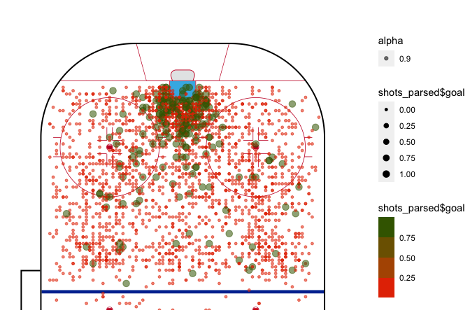
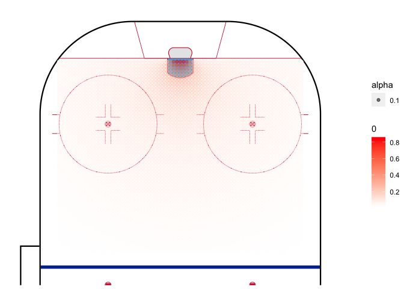
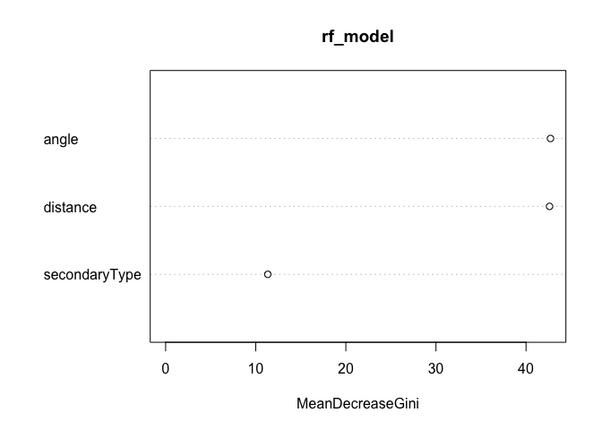

NHL xG
================

- <a href="#overview-and-scope" id="toc-overview-and-scope">Overview and
  Scope</a>
- <a href="#data-wrangling" id="toc-data-wrangling">Data Wrangling</a>
- <a href="#data-exploration" id="toc-data-exploration">Data
  Exploration</a>
  - <a href="#histograms" id="toc-histograms">Histograms</a>
  - <a href="#probability-of-a-goal-given-distance-or-angle"
    id="toc-probability-of-a-goal-given-distance-or-angle">Probability of a
    Goal Given Distance or angle</a>
  - <a href="#shot-plots" id="toc-shot-plots">Shot Plots</a>
- <a href="#model-building" id="toc-model-building">Model Building</a>
  - <a href="#linear-probability-model"
    id="toc-linear-probability-model">Linear Probability Model</a>
  - <a href="#logit" id="toc-logit">Logit</a>
  - <a href="#random-forest" id="toc-random-forest">Random Forest</a>
  - <a href="#xgboost" id="toc-xgboost">xGBoost</a>
- <a href="#sources" id="toc-sources">Sources</a>

## Overview and Scope

The aim of this project is to build different naive Expected Goals
models using LPM, logit and possibly other regression models at some
point. The data is obtained from
[Kaggle](https://www.kaggle.com/datasets/martinellis/nhl-game-data) and
valuables sources that have been utilized are in this
[section](Sources).

Unfortunately Github-flavored documents don’t support code-folding, and
hence as of now the notebook is showing all the code even for the plots.

## Data Wrangling

Loading the data and creating a variable for shot data

``` r
game_plays <- read.csv("~/Downloads/archive/game_plays.csv")

## Making sure the data looks correct, showing first 18 samples and the response variable
str(game_plays)
```

    ## 'data.frame':    5050529 obs. of  18 variables:
    ##  $ play_id            : chr  "2016020045_1" "2016020045_2" "2016020045_3" "2016020045_4" ...
    ##  $ game_id            : int  2016020045 2016020045 2016020045 2016020045 2016020045 2016020045 2016020045 2016020045 2016020045 2016020045 ...
    ##  $ team_id_for        : int  NA NA NA 16 16 16 4 4 16 16 ...
    ##  $ team_id_against    : int  NA NA NA 4 4 4 16 16 4 4 ...
    ##  $ event              : chr  "Game Scheduled" "Period Ready" "Period Start" "Faceoff" ...
    ##  $ secondaryType      : chr  NA NA NA NA ...
    ##  $ x                  : int  NA NA NA 0 -71 -88 0 56 11 -68 ...
    ##  $ y                  : int  NA NA NA 0 9 5 0 -7 21 37 ...
    ##  $ period             : int  1 1 1 1 1 1 1 1 1 1 ...
    ##  $ periodType         : chr  "REGULAR" "REGULAR" "REGULAR" "REGULAR" ...
    ##  $ periodTime         : int  0 0 0 0 54 56 58 69 78 88 ...
    ##  $ periodTimeRemaining: int  1200 1200 1200 1200 1146 1144 1142 1131 1122 1112 ...
    ##  $ dateTime           : chr  "2016-10-18 23:40:58" "2016-10-19 01:35:28" "2016-10-19 01:40:50" "2016-10-19 01:40:50" ...
    ##  $ goals_away         : int  0 0 0 0 0 0 0 0 0 0 ...
    ##  $ goals_home         : int  0 0 0 0 0 1 1 1 1 1 ...
    ##  $ description        : chr  "Game Scheduled" "Period Ready" "Period Start" "Jonathan Toews faceoff won against Claude Giroux" ...
    ##  $ st_x               : int  NA NA NA 0 71 88 0 56 -11 68 ...
    ##  $ st_y               : int  NA NA NA 0 -9 -5 0 -7 -21 -37 ...

Parsing the data to include only the shots and goals

``` r
shots <- na.omit(game_plays) %>%
  filter(event %in% c("Goal", "Shot")) %>%
  select(team_id_for, event, st_x, st_y, secondaryType)

## Creating a new column for a binary response variable if a shot was a goal or not
shots$goal <- as.integer(ifelse(shots$event == "Goal", 1,0))
```

Creating local variables for x and y cordinates

``` r
##Taking the absolute value to have all the shots in the same horizontal axis
x <- abs(shots$st_x)
y <- shots$st_y
```

Creating functions for distance and angle. Distance from the shot place
to the center of the goal is calculated by

$c^2 = a^2 + b^2 \Rightarrow c = \sqrt{a^2 + b^2 }$

The angle visible to the player is calculated as follows,

$\tan \theta = \frac{\text{goal width } * x }{x^2 + y^2 - (\frac{\text{goal width}}{2})^2 }$

``` r
distance <- function(x_pos, y_pos) {
  sqrt((89 - abs(x_pos))^2 + y_pos^2)
}

angle_theta <- function(x_pos, y_pos) {
  x_temp <- abs(89 - abs(x_pos))
    ifelse((x_temp)^2 + (y_pos)^2 >= 9, atan((6 * abs(x_temp))/(x_temp^2 + y_pos^2 - 3^2)) * 180 / pi,
    180 + atan((6 * x_temp)/(x_temp^2 + y_pos^2 - 3^2)) * 180 / pi)
}

## Making sure our range is correct, should be between 0 and 180
range(angle_theta(x,y),na.rm=TRUE)
```

    ## [1]   0 180

``` r
## adding columns for distance and angle
shots <- shots %>%
  mutate(distance = distance(shots$st_x, shots$st_y),
                    angle = angle_theta(shots$st_x, shots$st_y))
## Testing this works
head(shots)
```

    ##   team_id_for event st_x st_y secondaryType goal distance     angle
    ## 1          16  Shot   71   -9    Wrist Shot    0 20.12461 15.255119
    ## 2          16  Goal   88   -5   Wrap-around    1  5.09902 19.440035
    ## 3           4  Shot   56   -7    Wrist Shot    0 33.73426  9.947172
    ## 4          16  Shot   37   24     Slap Shot    0 57.27128  5.448598
    ## 5           4  Shot   57  -20    Wrist Shot    0 37.73592  7.727217
    ## 6           4  Shot   34   14     Slap Shot    0 56.75385  5.865971

## Data Exploration

### Histograms

a couple of histograms from the data that show the distribution of shot
distance and angle

``` r
par(mar = c(4, 4, .1, .1))
ggplot(shots, aes(x=shots$angle)) +
  geom_histogram(binwidth = 3,
                 center = 0,
                 color = "black",
                 fill = "white") +
  scale_x_continuous(limits = c(0, 180)) +
  theme_bw() +
  theme(panel.border = element_blank()) + 
  theme(panel.grid.major = element_blank()) +
  theme(panel.grid.minor = element_blank()) + 
  xlab("angles") + 
  ylab(element_blank()) + 
  ggtitle("Histogram of Shot angles")

ggplot(shots, aes(x=distance)) +
    geom_histogram(binwidth = 6,
                   center = 0,
                   color = "black",
                   fill = "white") +
    scale_x_continuous(limits = c(0, 180)) +
    theme_bw() +
  theme(panel.border = element_blank()) + 
    theme(panel.grid.major = element_blank()) +
    theme(panel.grid.minor = element_blank()) + 
    xlab("Distance") + 
    ylab(element_blank()) + 
    ggtitle("Histogram of Shot Distances")
```


### Probability of a Goal Given Distance or angle

``` r
bins_distance <- aggregate(shots,
                   by=list(cut(shots$distance, seq(0,100,10))),
                   mean)

bins_angle <- aggregate(shots,
                  by=list(cut(shots$angle, seq(0,180,10))),
                  mean)

## Changing the first column to numeric values so that ggplot geom_smooth works
bins_distance$Group.1 <- as.numeric(bins_distance$Group.1)
bins_angle$Group.1 <- as.numeric(bins_angle$Group.1)

angles <- as.character(seq(0, 180, 10))
distances <- as.character(seq(0, 90, 10))


ggplot(bins_distance, aes(x= bins_distance$Group.1, y =  bins_distance$goal)) +
                          geom_point() +
                          geom_line() +
                          theme_bw() + 
                          xlab("Distance to goal (Feet)") +
                          ylab("Probability of Goal") + 
                          scale_x_discrete(limits = distances) +
                          ggtitle("Probability of Goal Given the Distance")
                          
ggplot () + aes(x= bins_angle$Group.1, y =  bins_angle$goal) +
  geom_point() +
  geom_smooth(method=lm, se = F) + 
  theme_bw() +
  xlab("angle to Goal") +
  ylab("Probability of Goal") + 
  ggtitle("Probability of Goal Given the angle") +
  scale_x_discrete(limits = angles)
```


In the distance to goal there’s an interesting fact: probability of goal
increases with distance. This is likely due to the fact that usually
shots from very far away are shot due to empty goal: hence it scewing
the data. In angle to goal there’s no notable surprises.

### Shot Plots

``` r
#Shot maps for randomly samples 2500 shots for faster computations and more informative plots 
shots_parsed <- shots %>%
  subset(st_x < 88) %>%
  sample_n(2500)

geom_hockey(league = "NHL", rotation = 90, display_range = "ozone") +
  geom_point(aes(x = shots_parsed$st_y, y = shots_parsed$st_x, col = shots_parsed$goal, alpha = 0.9, size = shots_parsed$goal)) +
  scale_color_binned(low ="red", high = "darkgreen") +
  scale_size_continuous(range = c(1,3))

geom_hockey(league = "NHL", rotation = 90, display_range = "ozone") +
  geom_density2d_filled(aes(x = shots_parsed$st_y, y = shots_parsed$st_x, alpha = 0.5),
                        contour_var = "ndensity",
                        breaks = seq(0.1, 1.0, length.out = 10))
```



## Model Building

Here we split the data as a cross validation technique, using 70% of the
data as the training data and the rest 30% as the testing data. A new
explanatory variable - secondaryType - is introduced, which includes
information on the shot type. It will be used in the later models.

``` r
unique(shots$secondaryType)
```

    ## [1] "Wrist Shot"  "Wrap-around" "Slap Shot"   "Tip-In"      "Snap Shot"  
    ## [6] "Backhand"    "Deflected"

``` r
## Checking for NA values 
sum(is.na(shots))
```

    ## [1] 28

``` r
parsed_shots <- na.omit(shots) %>%
  select(goal, distance, angle, secondaryType) %>%
  mutate(distance_sq = (distance^2))
  
train_test_split <- initial_split(data = parsed_shots, prop = 0.7)

train_data <- train_test_split %>%
  training()
test_data <- train_test_split %>%
  testing()
```

Because the quantity of NA’s was so small, we can just omit them from
the further analysis.

### Linear Probability Model

``` r
LPM <- lm(goal ~ distance + angle, data = train_data)
summary(LPM)
```

    ## 
    ## Call:
    ## lm(formula = goal ~ distance + angle, data = train_data)
    ## 
    ## Residuals:
    ##      Min       1Q   Median       3Q      Max 
    ## -0.91299 -0.10979 -0.06320 -0.03958  1.01889 
    ## 
    ## Coefficients:
    ##               Estimate Std. Error t value Pr(>|t|)    
    ## (Intercept)  7.283e-02  1.452e-03   50.17   <2e-16 ***
    ## distance    -1.088e-03  2.684e-05  -40.54   <2e-16 ***
    ## angle        4.680e-03  4.879e-05   95.92   <2e-16 ***
    ## ---
    ## Signif. codes:  0 '***' 0.001 '**' 0.01 '*' 0.05 '.' 0.1 ' ' 1
    ## 
    ## Residual standard error: 0.2846 on 650570 degrees of freedom
    ## Multiple R-squared:  0.04981,    Adjusted R-squared:  0.04981 
    ## F-statistic: 1.705e+04 on 2 and 650570 DF,  p-value: < 2.2e-16

In the plot below, the the main downside of LPM model becomes apparent:
results are not bound \[0,1\].

``` r
artificial_shots <- crossing(location_x = seq(30, 88, by = 1), location_y = seq(-37, 37, by = 1))

artificial_shots$distance <- distance(artificial_shots$location_x, artificial_shots$location_y)
artificial_shots$angle <- angle_theta(artificial_shots$location_x, artificial_shots$location_y)
artificial_shots$distance_sq <- artificial_shots$distance^2
artificial_shots$xg <- predict(LPM, artificial_shots, type = "response")

geom_hockey(league = "NHL", rotation = 90, display_range = "ozone") +
  geom_point(aes(x = artificial_shots$location_y, y = artificial_shots$location_x, col = artificial_shots$xg, alpha = 1)) +
  scale_color_gradient2(low = "white", mid="red", midpoint = 0.55, high ="darkred",
                       scales::rescale(c(0.9,0.1))) 

ggplot(data = LPM, mapping=aes(x=angle, y = goal)) +
  geom_point(size = 0.01) + geom_smooth(method = "lm", se = F, size = 0.5) +
  theme_bw()
```


### Logit

Due to the significant downsides of LPM, logistic regression is
henceforth used.

``` r
logit <- glm(goal ~ distance + angle,
             family = binomial(link = 'logit'),
             data = train_data)
```

In a logit model, the probability of an event is given by

$P = \frac{1}{1 + - exp^{-{(\beta_0 + \beta_1 x_1 \beta_2 x_2 + …)}}}$

``` r
ggplot(logit, aes(x=distance, y =goal)) +
  geom_point() + geom_smooth(method = "glm", method.args = list(family = "quasibinomial"), se = F) +
  theme_bw() +
  xlab("Distance to Goal") +
  ylab("Probability of Goal") + 
  ggtitle("Distance as an explanatory variable") 

ggplot(logit, aes(x=angle, y =goal)) +
  geom_point(size = 0.01) + geom_smooth(method = "glm", method.args = list(family = "quasibinomial"), se = F) +
  theme_bw() +
  xlab("angle to Goal") +
  ylab("Probability of Goal") + 
  ggtitle("angle as an explanatory variable") 
```


From graphs above, it becomes visually clear that angle is a way more
important factor affecting if a shot is a goal or not. To test whether
we could improve explanatory power of distance, we add a quadratic form
of it as an extra variable.

``` r
logit.2 <- glm(goal ~ distance + distance_sq + angle,
               family = binomial(link = 'logit'),
               data = train_data)

logit_coef <- logit$coefficients
logit_distance <- logit_coef["distance"]
logit_intercept <- logit_coef["(Intercept)"]

logit.2_coef <- logit.2$coefficients
logit.2_distance <- logit.2_coef["distance"]
logit.2_distance_sq <- logit.2_coef["distance_sq"]
logit.2_intercept <- logit.2_coef["(Intercept)"]

b <- data.frame(c(seq(0,100,.1)))
a <- (1 / (1 + exp(-logit.2_distance * b - logit.2_distance_sq * b - logit.2_intercept)))
a.2 <- (1 / (1 + exp(-logit_distance * b - logit_intercept)))
c <- cbind(a, a.2, b)

colnames(c) <- c("a", "a.2", "b")
```

``` r
artificial_shots <- crossing(location_x = seq(30, 88, by = 1), location_y = seq(-37, 37, by = 1))

artificial_shots$distance <- distance(artificial_shots$location_x, artificial_shots$location_y)
artificial_shots$angle <- angle_theta(artificial_shots$location_x, artificial_shots$location_y)
artificial_shots$distance_sq <- artificial_shots$distance^2

artificial_shots$xg_logit <- predict(logit.2, artificial_shots, type = "response")
```

``` r
ggplot(c, aes(x=b,y=a)) +
  geom_point(size = 0.1, col = "darkgreen") + 
  geom_point(aes(y=a.2), size = 0.1, col = "darkred") +
  theme_bw() + 
  ggtitle("Comparing Distance Variables with and without quadratic term") +
  xlab("Distance to Goal") +
  ylab("Probability of a Goal")

geom_hockey(league = "NHL", rotation = 90, display_range = "ozone") +
  geom_point(aes(x = artificial_shots$location_y, y = artificial_shots$location_x, col = artificial_shots$xg_logit, alpha = 0.1)) +
  scale_color_gradient(low = "white", high ="red",
                       scales::rescale(c(0.1,0.9))) 
```



As we can see from the graph above, including the quadratic term makes a
difference but not a suitable one. Namely, it decreases the probability
when close the goal and increases it when further away, increasing the
‘empty-net bias’. Hence, we keep using the original logit model as the
baseline.

Next, we add the previously mentioned shot type into the regression and
compare the perfomance between that and the baseline model.

``` r
logit.3 <- glm(goal ~ distance + angle + secondaryType,
             family = binomial(link = 'logit'),
             data = train_data)

#Creating vectors of predictors for the new model with secondaryType and for the last one without it 
logit_pred <- predict(logit, test_data, type = "response")
logit.3_pred <- predict(logit.3, test_data, type = "response")

#Comparing Logit models with AUC values
roc.test(roc(test_data$goal, logit.3_pred), roc(test_data$goal, logit_pred))
```

    ## 
    ##  DeLong's test for two correlated ROC curves
    ## 
    ## data:  roc(test_data$goal, logit.3_pred) and roc(test_data$goal, logit_pred)
    ## Z = 21.105, p-value < 2.2e-16
    ## alternative hypothesis: true difference in AUC is not equal to 0
    ## 95 percent confidence interval:
    ##  0.008810688 0.010614644
    ## sample estimates:
    ## AUC of roc1 AUC of roc2 
    ##   0.7186406   0.7089280

``` r
# Comparing models with AIC values 
print(paste("AIC without shot type:", logit$aic))
```

    ## [1] "AIC without shot type: 376620.331773441"

``` r
print(paste("AIC with shot type:", logit.3$aic))
```

    ## [1] "AIC with shot type: 373992.665487717"

``` r
par(pty = "s")

logit.3_roc <- roc(test_data$goal, logit.3_pred, plot = TRUE, print.auc = TRUE, col = "darkred",
  legacy.axes = TRUE, percent = TRUE, xlab = "False Positive Percentage",
  ylab = "True Positive Percentage") 
```

<!-- -->

``` r
#Observing the optimal threshold level and the corresponding specificity and sensitivity levels
logit.3_threshold <- coords(logit.3_roc, "best", "threshold")
logit.3_threshold
```

    ##    threshold specificity sensitivity
    ## 1 0.08503884    61.70512    73.04465

Here is one of the puzzles when using a logit model: which threshold to
use when categorizing a shot. Using the coords function, we find the
threshold which maximizes both accuracy and specifity, but not the model
accuracy. After trying different thresholds, we could get the model
accuracy above 90%, but with the cost that specifity drops down to under
30%. Therefore, for the purposes of this project we continue with the
value given by the coords function.

``` r
#Creating Confusion Matrix
logit.3_conf <- table(logit.3_pred>=logit.3_threshold$threshold, test_data$goal)
logit.3_conf
```

    ##        
    ##              0      1
    ##   FALSE 156014   7003
    ##   TRUE   96824  18977

``` r
#Model accuracy
sum(diag(logit.3_conf))/sum(logit.3_conf)*100
```

    ## [1] 62.76173

``` r
## Calculating Pseudo R^2
ll.null <- logit.3$null.deviance/-2
ll.proposed <- logit.3$deviance/-2

(ll.null - ll.proposed) / ll.null
```

    ## [1] 0.07838084

``` r
## Calculating the p-value for the pseudo R squared
1 - pchisq(2*(ll.proposed - ll.null), df = (length(logit.3$coefficients) -1))
```

    ## [1] 0

The pseudo r-squared is very low and the p-value is zero, making the
statistic robust.

``` r
pred_logit.3 <- data.frame(prob.of.goal = logit.3$fitted.values,
                           goal = train_data$goal)

pred_logit.3 <- pred_logit.3[
  order(pred_logit.3$prob.of.goal, decreasing = FALSE),]

pred_logit.3$rank <- 1:nrow(pred_logit.3)

ggplot(data = pred_logit.3, aes(x = rank, y = prob.of.goal)) +
  geom_point(aes(color = goal), alpha = 1, shape = 4, stroke = 2) + 
  scale_color_binned(low = "red", high = "navyblue") +
  theme_bw() +
  labs(x = "Index",
       y = "Probability of a Goal",
       title = "Overview of the Logit Model")
```

<!-- -->

Comparing this analysis to the other similar ones, people usually stop
at this point because for such simple binary classification, logit if
usually enough. There’s no sense in applying more advanced models if we
can get by with this. Moreover, tuning hyper parameters (L1, L2,
elastic-net) similarly have empirically made very little difference to
the results with so little explanatory variables.

However, I will start tuning the parameters for the logit model and
introduce other machine learning classification models for own
educational purposes. Further analysis will be done with the package
‘mikropml’ (which is built on top of ‘caret’) when adjusting the L2
Ridge regularization parameter, as elastic net and L1 in this case would
be useless due of the importance of all variables. Pre-processing steps
to be made to prepare data for the packages mentioned:

- Creating own column for each shot type and removing the original
  column
- Modifying outcome column to not have spaces in the end result

Data will not be centered (at least at this point) to save
interpretability. Missing values are not an issue, as we omitted all 28
of them in the beginning.

This dataset is very small compared to the full sample (\~900k shots)
due to the heavy computation made by caret and mikropml. This will
possibly be solved in the future by using parallelized processing.

``` r
library(caret)
library(mikropml)

parsed_shots.logit <- parsed_shots %>%
  select(goal, distance, angle, secondaryType) %>%
  sample_n(size = 2500)

dummy_shots <- dummyVars("~.", data = parsed_shots.logit)
parsed_shots.logit <- data.frame(predict(dummy_shots, newdata = parsed_shots.logit))

parsed_shots.logit$goal <- ifelse(test=parsed_shots.logit$goal == "1", yes = "goal", no = "notagoal")
parsed_shots.logit$goal <- as.factor(parsed_shots.logit$goal)
str(parsed_shots.logit)
```

    ## 'data.frame':    2500 obs. of  10 variables:
    ##  $ goal                    : Factor w/ 2 levels "goal","notagoal": 2 2 1 2 2 1 2 2 2 2 ...
    ##  $ distance                : num  38.6 10.8 44.7 20.6 10 ...
    ##  $ angle                   : num  8.29 26.57 6.87 16.09 33.11 ...
    ##  $ secondaryTypeBackhand   : num  0 1 0 0 0 0 0 0 0 0 ...
    ##  $ secondaryTypeDeflected  : num  0 0 0 0 0 0 0 0 0 0 ...
    ##  $ secondaryTypeSlap.Shot  : num  0 0 0 0 0 0 1 0 0 0 ...
    ##  $ secondaryTypeSnap.Shot  : num  0 0 1 0 0 1 0 0 0 0 ...
    ##  $ secondaryTypeTip.In     : num  0 0 0 0 1 0 0 0 0 0 ...
    ##  $ secondaryTypeWrap.around: num  0 0 0 0 0 0 0 0 0 0 ...
    ##  $ secondaryTypeWrist.Shot : num  1 0 0 1 0 0 0 1 1 1 ...

``` r
get_srn_results <- run_ml(parsed_shots.logit,
                          method ="glmnet",
                          outcome_colname = "goal",
                          training_frac = 0.8,
                          kfold = 3,
                          seed = 1999)

get_srn_results$trained_model
```

    ## glmnet 
    ## 
    ## 2001 samples
    ##    9 predictor
    ##    2 classes: 'goal', 'notagoal' 
    ## 
    ## No pre-processing
    ## Resampling: Cross-Validated (3 fold, repeated 100 times) 
    ## Summary of sample sizes: 1333, 1335, 1334, 1335, 1334, 1333, ... 
    ## Resampling results across tuning parameters:
    ## 
    ##   lambda  logLoss    AUC        prAUC      Accuracy   Kappa          F1        
    ##   1e-04   0.2773047  0.7233463  0.5856538  0.9094654   2.282663e-02  0.04607646
    ##   1e-03   0.2773047  0.7233463  0.5856538  0.9094654   2.282663e-02  0.04607646
    ##   1e-02   0.2773620  0.7232032  0.5857039  0.9095804   2.093704e-02  0.04431809
    ##   1e-01   0.2827281  0.7166782  0.5821340  0.9095306  -2.959824e-05         NaN
    ##   1e+00   0.2977691  0.7061329  0.5757637  0.9095456   0.000000e+00         NaN
    ##   1e+01   0.3028915  0.7037235  0.5743715  0.9095456   0.000000e+00         NaN
    ##   Sensitivity  Specificity  Pos_Pred_Value  Neg_Pred_Value  Precision
    ##   0.01458834   0.9984615    0.5389043       0.9106239       0.5389043
    ##   0.01458834   0.9984615    0.5389043       0.9106239       0.5389043
    ##   0.01320674   0.9987253    0.5657573       0.9105312       0.5657573
    ##   0.00000000   0.9999835    0.0000000       0.9095442       0.0000000
    ##   0.00000000   1.0000000          NaN       0.9095456             NaN
    ##   0.00000000   1.0000000          NaN       0.9095456             NaN
    ##   Recall      Detection_Rate  Balanced_Accuracy
    ##   0.01458834  0.001319282     0.5065249        
    ##   0.01458834  0.001319282     0.5065249        
    ##   0.01320674  0.001194329     0.5059660        
    ##   0.00000000  0.000000000     0.4999918        
    ##   0.00000000  0.000000000     0.5000000        
    ##   0.00000000  0.000000000     0.5000000        
    ## 
    ## Tuning parameter 'alpha' was held constant at a value of 0
    ## AUC was used to select the optimal model using the largest value.
    ## The final values used for the model were alpha = 0 and lambda = 0.001.

As suspected, lambda value is very small and hence regularization makes
very little difference.

### Random Forest

As random forest calculation is computationally heavy and parallel
computation is not yet introduced, we will make the dataset even smaller
and pivot back to secondaryType explanatory factor (insted of having
multiple columns for each shot type)

``` r
parsed_shots.rf <- parsed_shots %>%
  select(goal, distance, angle, secondaryType) %>%
  sample_n(size = 1000)

## Changing labels from 0 and 1 to "Goal" and "Not Goal" 
parsed_shots.rf$goal <- ifelse(test=parsed_shots.rf$goal == "1", yes = "Goal", no = "Not Goal")

## Changing the class of some columns for the commands to work
parsed_shots.rf$goal <- as.factor(parsed_shots.rf$goal)
parsed_shots.rf$secondaryType <- as.factor(parsed_shots.rf$secondaryType)

## Checking all classes are either numerical or factor
str(parsed_shots.rf)
```

    ## 'data.frame':    1000 obs. of  4 variables:
    ##  $ goal         : Factor w/ 2 levels "Goal","Not Goal": 2 2 2 2 2 2 2 2 2 2 ...
    ##  $ distance     : num  57.2 22.6 26 44.8 51 ...
    ##  $ angle        : num  5.98 10.81 13.14 4.8 5.95 ...
    ##  $ secondaryType: Factor w/ 7 levels "Backhand","Deflected",..: 4 7 7 7 7 7 7 7 7 3 ...
    ##  - attr(*, "na.action")= 'omit' Named int [1:28] 12765 65754 69394 96807 158857 160780 179790 196741 221925 263543 ...
    ##   ..- attr(*, "names")= chr [1:28] "12765" "65754" "69394" "96807" ...

``` r
## Making the model.
rf_model <- randomForest(goal ~ ., data = parsed_shots.rf, proximity = TRUE, ntree = 1000)

## This is to see how many trees are necessary for accurate predictions. It calculates the error rates after making of each tree. 
oob.error.data <- data.frame(
  trees=rep(1:nrow(rf_model$err.rate), times = 3),
  type=rep(c("OOB", "Goal", "Not Goal"), each=nrow(rf_model$err.rate)),
  error=c(rf_model$err.rate[,"OOB"],
          rf_model$err.rate[,"Goal"],
          rf_model$err.rate[,"Not Goal"]))

ggplot(data=oob.error.data, aes(x=trees, y=error)) +
  geom_line(aes(color=type)) +
  theme_bw() +
  ggtitle("OOB Error Rate")


## Calculating Out-of-the-bag error rates for different mtrys, which means how many variables are randomly sampled as candidates at each split. 
oob.values <- vector(length = 10)
for(i in 1:10){
  temp.rf_model <- randomForest(goal ~., data = parsed_shots.rf, mtry = i,
                                ntree = 100)
  oob.values[i] <- temp.rf_model$err.rate[nrow(temp.rf_model$err.rate), 1]
}

## Looking for the mtry that gives smallest OOB error
oob.values
```

    ##  [1] 0.097 0.118 0.123 0.122 0.118 0.117 0.118 0.128 0.121 0.124

``` r
## Building a MDS plot 
distance.matrix <- dist(1 - rf_model$proximity)
mds.stuff <- cmdscale(distance.matrix, eig=TRUE, x.ret = TRUE)
mds.var.per <- round(mds.stuff$eig/sum(mds.stuff$eig)*100, 1)
mds.values <- mds.stuff$points
mds.data <- data.frame(Sample=rownames(mds.values),
                       X=mds.values[,1],
                       Y = mds.values[,2],
                       Status = parsed_shots.rf$goal)

ggplot(data=mds.data, aes(x=X, y=Y, label = Sample)) +
  theme_bw() +
  geom_text(aes(color=Status)) +
  xlab(paste("MDS1 - ", mds.var.per[1], "%", sep = "")) +
  ylab(paste("MDS2 - ", mds.var.per[2], "%", sep = "")) +
  ggtitle("MDS plot using (1 - Random Forest Proximities)") +
  theme_bw()
```


``` r
varImpPlot(rf_model)

rf_model.pred <- predict(rf_model, parsed_shots.rf, select = -goal,
                         type = "class")


rf_model.pred.results <- table(rf_model.pred, parsed_shots.rf$goal)
head(rf_model.pred.results)
```

    ##              
    ## rf_model.pred Goal Not Goal
    ##      Goal       21        1
    ##      Not Goal   73      905

``` r
rf_model.pred.results
```

    ##              
    ## rf_model.pred Goal Not Goal
    ##      Goal       21        1
    ##      Not Goal   73      905

``` r
print(rf_model.accuracy <- sum(diag(rf_model.pred.results)) / sum(rf_model.pred.results))                                
```

    ## [1] 0.926



### xGBoost

To be updated

## Sources

Valuable sources have been:

- <https://github.com/Dato-Futbol/xg-model/blob/master/04code_evaluate_use_models.R>
- <https://www.thesignificantgame.com/portfolio/expected-goals-model-with-tidymodels/>
- <https://www.datofutbol.cl/xg-model/>
- <https://medium.com/datos-y-ciencia/una-mirada-al-soccer-analytics-usando-r-parte-iii-3bdff9cd3752>
- <https://rstudio-pubs-static.s3.amazonaws.com/311470_f6e88d4842da46e9941cc6547405a051.html>
- <https://soccermatics.readthedocs.io/en/latest/gallery/lesson2/plot_xGModelFit.html>
- <https://github.com/iandragulet/xG_Model_Workflow/blob/main/xG_model_part1.ipynb>
